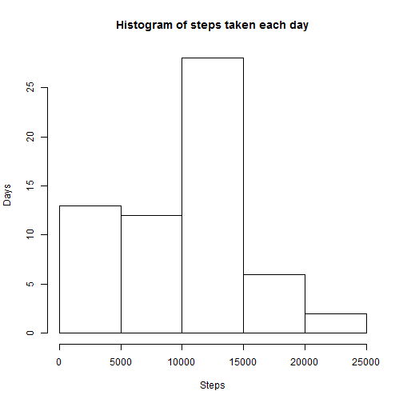
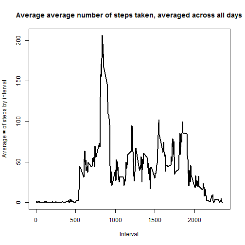
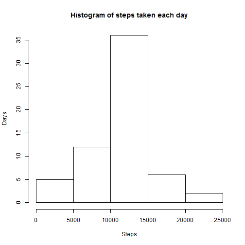
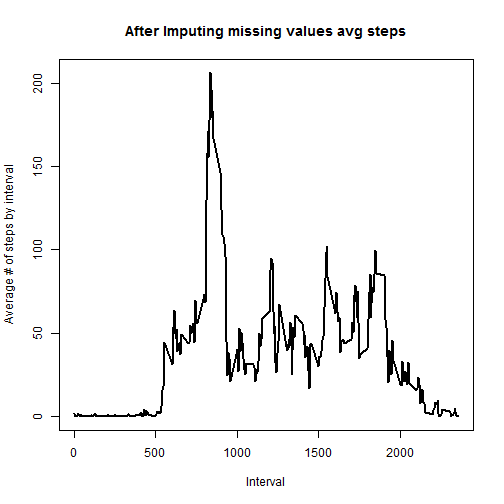
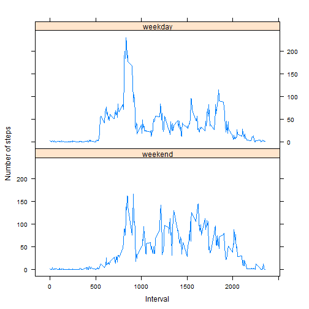

#### Loading and preprocessing the data

First you need to load the data , We'll use dplyr package


```r
library(dplyr)
activity <- read.csv(file="activity.csv", header=TRUE,sep=",",stringsAsFactors=FALSE)
activity <-tbl_df(activity)
```

#### What is mean total number of steps taken per day?

Find number of steps taken each day - while ignoring NA value


```r
stepsByDay <- activity %>% group_by(date) %>% summarise(sumsteps= sum(steps,na.rm=TRUE))
hist(stepsByDay$sumsteps,ylab="Days",xlab="Steps", main=" Histogram of steps taken each day ")
```

 

```r
meanStepsByDay<-mean(stepsByDay$sumsteps,na.rm=TRUE)
medianStepsByDay<-median(stepsByDay$sumsteps,na.rm=TRUE)
print(paste0("The mean and median of steps by day are : ",meanStepsByDay," and ",medianStepsByDay))
```

```
## [1] "The mean and median of steps by day are : 9354.22950819672 and 10395"
```


#### What is the average daily activity pattern?

```r
stepsByInterval <- activity %>% group_by(interval) %>% summarise(meansteps= mean(steps,na.rm=TRUE))
plot(stepsByInterval$interval, stepsByInterval$meansteps, type="l",
     xlab="Interval", ylab="Average # of steps by interval",
     main="Average average number of steps taken, averaged across all days", 
     lwd=2)
```

 

```r
maxIntIdx <- which.max(stepsByInterval$meansteps)
maxIntVal <- stepsByInterval[maxIntIdx,1]
print(paste0("The interval with highest average number of steps is : ",maxIntVal))
```

```
## [1] "The interval with highest average number of steps is : 835"
```


#### Imputing missing values

Find all occurrences of missing values.  Replace those by average number of steps for that interval  The new mean and median will change as number of steps in a day increase.  There is convergence between mean and median  and the average steps for interval stay the same


```r
# First lets find how many missing values are there
print(paste0("The number of occurrences of missing values is : ",length(which(is.na(activity)))))
```

```
## [1] "The number of occurrences of missing values is : 2304"
```

```r
# Lets make a copy of activity and replace NAs with the mean for that interval
activityUpd<-activity
noRows <- nrow(activityUpd)
for ( i in c(1:noRows)){
  if (is.na(activityUpd[i,"steps"])){
    intervalIdx <- stepsByInterval$interval == activityUpd[[i,"interval"]]
    activityUpd[i,"steps"]<-stepsByInterval[intervalIdx,"meansteps"]
  }
    
}

## The new mean and median will change as number of steps in a day increase and there is convergence between mean and median
## But the average steps for interval stay the same

stepsByDayUpd <- activityUpd %>% group_by(date) %>% summarise(sumsteps= sum(steps,na.rm=TRUE))
hist(stepsByDayUpd$sumsteps,ylab="Days",xlab="Steps", main=" Histogram of steps taken each day ")
```

 

```r
meanStepsByDayUpd<-mean(stepsByDayUpd$sumsteps,na.rm=TRUE)
medianStepsByDayUpd<-median(stepsByDayUpd$sumsteps,na.rm=TRUE)
print(paste0("The mean and median of steps by day are : ",meanStepsByDayUpd," and ",medianStepsByDayUpd))
```

```
## [1] "The mean and median of steps by day are : 10766.1886792453 and 10766.1886792453"
```

```r
stepsByIntervalUpd <- activityUpd %>% group_by(interval) %>% summarise(meansteps= mean(steps,na.rm=TRUE))
plot(stepsByIntervalUpd$interval, stepsByIntervalUpd$meansteps, type="l",
     xlab="Interval", ylab="Average # of steps by interval",
     main="After Imputing missing values avg steps", 
     lwd=2)
```

 

```r
maxIntIdx <- which.max(stepsByIntervalUpd$meansteps)
maxIntVal <- stepsByInterval[maxIntIdx,1]
print(paste0("The interval with highest average number of steps is : ",maxIntVal))
```

```
## [1] "The interval with highest average number of steps is : 835"
```

#### Are there differences in activity patterns between weekdays and weekends?

Add a new column for weekday / weekend

Break into two datasets

Calculate averages for each data set

Combine them

Plot them in two charts


```r
library(lattice)

activityUpd$weekend<- weekdays(as.Date(activityUpd$date)) %in% c("Saturday","Sunday")
activityWeekend = activityUpd[activityUpd$weekend,]
activityWeekDay = activityUpd[!activityUpd$weekend,]

avgStepsWeekend <- activityWeekend %>% group_by(interval) %>% summarise(meansteps= mean(steps))
avgStepsWeekend <- cbind(avgStepsWeekend,"weekend")
avgStepsWeekDay <- activityWeekDay %>% group_by(interval) %>% summarise(meansteps= mean(steps))
avgStepsWeekDay <- cbind(avgStepsWeekDay,"weekday")
colnames(avgStepsWeekend)<-c("AvgSteps","interval","day")
colnames(avgStepsWeekDay)<-c("AvgSteps","interval","day")
avgStepsCombined <- rbind(avgStepsWeekend,avgStepsWeekDay)                            
xyplot(interval~AvgSteps|day,avgStepsCombined,layout=c(1,2),type="l",xlab="Interval",ylab="Number of steps")
```

 
